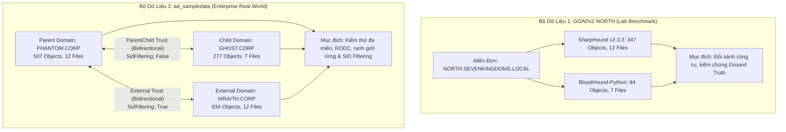
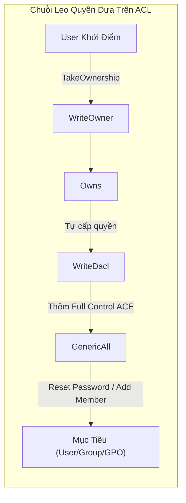
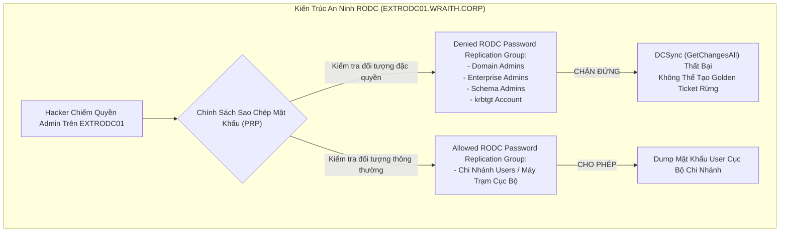
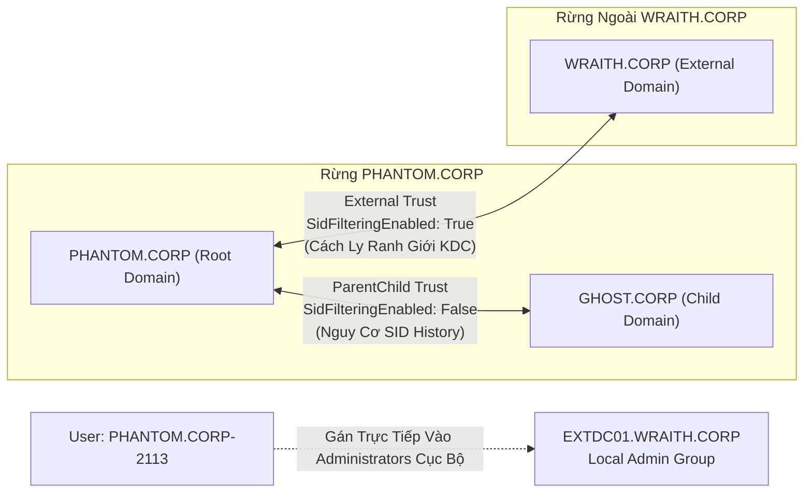

# Báo Cáo Nghiệm Thu Tuần 1: Khảo Sát Dữ Liệu Thực Tế, Cơ Chế Active Directory & ACL, Và Kiến Trúc Lược Đồ Đồ Thị (Graph Schema)

## 1. Tổng Quan Nghiệm Thu Tuần 1 (Executive Summary)

Báo cáo này tổng hợp toàn bộ kết quả nghiên cứu, khảo sát dữ liệu, phân tích cơ chế an ninh Active Directory (AD) và chuẩn hóa cấu trúc dữ liệu đồ thị trong Tuần 1 của đề tài Identity - Asset Graph.
Mục tiêu cốt lõi của Tuần 1 là thiết lập nền móng dữ liệu vững chắc và lược đồ chuẩn tắc (Schema Contract) nhằm phục vụ việc xây dựng đồ thị tấn công có trọng số (Weighted Attack Graph), thay thế cho cách tiếp cận đồ thị không trọng số mặc định của BloodHound.

Trong Tuần 1, nhóm nghiên cứu đã hoàn thành toàn diện 4 trụ cột kỹ thuật:
1. **Khảo sát dữ liệu thực nghiệm toàn diện trên 2 bộ dữ liệu (Dual-Dataset Framework):**
   Phân tích đối sánh Dataset 1 (GOADv2 NORTH - Đơn miền môi trường phòng lab chuẩn, phục vụ kiểm chứng ground truth và đối sánh công cụ thu thập) và Dataset 2 (`ad_sampledata` - Môi trường doanh nghiệp đa miền phức hợp gồm 3 domain `PHANTOM.CORP`, `GHOST.CORP`, `WRAITH.CORP`, 31 tệp JSON, 1.718 đối tượng).
2. **Giải mã chuyên sâu cơ chế Active Directory và các rào chắn kiểm soát truy cập (AD Mechanics & ACLs):**
   Xác định rõ ràng ngữ nghĩa kỹ thuật, dấu vết giám sát (SIEM/EDR), và điều kiện thực thi của 8 loại cạnh tấn công cốt lõi trong Milestone 1 (M1).
   Đồng thời mô hình hóa các rào cản an ninh đặc thù của Windows Server gồm: AdminSDHolder/SDProp, Protected Users, Password Replication Policy (PRP) trên Read-Only Domain Controller (RODC), bằng chứng truy cập cục bộ (Host-bound evidence), và ranh giới tin cậy liên miền (Domain Trust Boundaries).
3. **Chuẩn hóa kiến trúc lược đồ đồ thị (Graph Data Structure & Schema Contract):**
   Thiết kế hợp đồng dữ liệu cho Node và Edge, giải quyết triệt để các vấn đề lệch pha kiểu dữ liệu (Data Type Impedance Mismatch như `admincount` boolean vs integer), chuẩn hóa định danh chuẩn tắc (Canonical ID Normalization cho SID và GUID), và phân định rõ ràng 3 trạng thái bằng chứng thu thập (`verified_presence`, `verified_absence`, `unknown`).
4. **Mô hình hóa trọng số cạnh 4D MAUT (Multi-Attribute Utility Theory):**
   Định lượng hóa chi phí tấn công dựa trên 4 chiều độc lập (Prerequisites, Detectability, Technical Complexity, Reliability), cung cấp hàm chi phí $W(e) \in [1.0, 5.0]$ hoàn toàn khả thi cho thuật toán tìm đường ngắn nhất Dijkstra.

---

## 2. Khảo Sát Dữ Liệu Thực Tế và Phân Tích Đối Sánh Song Song (Dual-Dataset Profiling)

Để đảm bảo kết quả nghiên cứu vừa có tính kiểm chứng khoa học chính xác trong môi trường kiểm soát, vừa có khả năng thích ứng với các môi trường doanh nghiệp quy mô lớn, đề tài áp dụng Khung Đánh Giá Song Song Hai Bộ Dữ Liệu (ADR-0006).



### 2.1. Dataset 1: Benchmark Lab GOADv2 (Đơn Miền `NORTH.SEVENKINGDOMS.LOCAL`)

Dataset 1 đại diện cho môi trường lab phòng thủ/tấn công chuẩn hóa Game of Active Directory v2 (GOADv2).
Tập dữ liệu này cung cấp các kịch bản khai thác có chủ đích đã biết trước kết quả (Ground Truth) để thẩm định tính chính xác của các đường tấn công tìm được.

#### Bảng Thống Kê Đối Tượng Dataset 1
| Loại Đối Tượng (Kind) | SharpHound v2.3.3 | BloodHound-Python | Ghi Chú Kỹ Thuật |
| :--- | :---: | :---: | :--- |
| **Domain** | 1 | 1 | `NORTH.SEVENKINGDOMS.LOCAL` |
| **Users** | 16 | 16 | Tài khoản người dùng và quản trị |
| **Computers** | 2 | 2 | `WINTERFELL` (DC) và `CASTELBLACK` (Member Server) |
| **Groups** | 84 | 54 | SharpHound thu thập thêm nhóm Built-in |
| **GPOs** | 3 | 3 | `DEFAULT DOMAIN POLICY`, `DEFAULT DC POLICY`, `STARKWALLPAPER` |
| **OUs** | 7 | 7 | Cấu trúc đơn vị tổ chức |
| **Containers** | 197 | 11 | SharpHound duyệt toàn bộ cây LDAP container |
| **Hạ tầng AD CS** | 37 | 0 | 33 Certificate Templates, 4 CAs (Chỉ SharpHound hỗ trợ) |
| **Tổng số đối tượng** | **347** | **94** | Chênh lệch chủ yếu do Containers và AD CS |

#### Phát Hiện Chênh Lệch Thu Thập Giữa Hai Công Cụ (Collector Discrepancy Analysis)
1. **Ủy thác Kerberos có ràng buộc (Kerberos Constrained Delegation):**
   Trong tệp thu thập của SharpHound v2.3.3 (`NORTH_20240410083414_computers.json`), trường `AllowedToDelegate` trên máy trạm `CASTELBLACK$` hoàn toàn rỗng (`[]`).
   Tuy nhiên, bản thu thập của `bloodhound-python` đọc trực tiếp thuộc tính LDAP `msDS-AllowedToDelegateTo` và xác định chính xác `CASTELBLACK$` được phép ủy thác tới dịch vụ cifs/ldap trên Domain Controller `WINTERFELL$`.
   Đây là một mắt xích tối quan trọng cho phép kẻ tấn công thực hiện kỹ thuật S4U2self và S4U2proxy để leo thẳng lên quyền Domain Admin chỉ qua 1 bước nhảy.
2. **Phiên đăng nhập người dùng (User Sessions):**
   SharpHound ghi nhận 4 phiên làm việc thông qua đọc Registry từ xa (`HasSession`), trong khi bản Python không ghi nhận phiên nào do thiếu quyền truy cập cổng RPC Endpoint Mapper (Port 135) và NetBIOS/SMB (Port 445).
3. **Hạ tầng Dịch vụ Chứng chỉ (AD CS):**
   SharpHound 2.3.3 thu thập đầy đủ 37 đối tượng AD CS (gồm các cấu hình template ESC1 - ESC8), trong khi BloodHound-Python phiên bản cũ bỏ qua hoàn toàn hạ tầng này.

### 2.2. Dataset 2: Môi Trường Doanh Nghiệp Đa Miền Phức Hợp (`ad_sampledata`)

Dataset 2 được trích xuất từ tệp lưu trữ doanh nghiệp `a8bfbcf9-4226-40ed-a0c4-a2cc05dbc708.zip`.
Bộ dữ liệu gồm 31 tệp JSON với dung lượng 3.5 MB, mô phỏng một hệ thống hạ tầng Active Directory đa miền hoàn chỉnh với 1.718 đối tượng.

#### Danh Mục Tệp và Bảng Phân Bố Đối Tượng 3 Domain
| Loại Đối Tượng | `PHANTOM.CORP` (Parent) | `GHOST.CORP` (Child) | `WRAITH.CORP` (External) | Tổng Đối Tượng |
| :--- | :---: | :---: | :---: | :---: |
| **Domains** | 1 | 1 | 1 | **3** |
| **Users** | 53 | 7 | 40 | **100** |
| **Computers** | 21 | 1 | 12 | **34** |
| **Groups** | 115 | 58 | 112 | **285** |
| **GPOs** | 22 | 3 | 7 | **32** |
| **OUs** | 13 | 1 | 6 | **20** |
| **Containers** | 208 | 206 | 707 | **1.121** |
| **CertTemplates** | 63 | 0 | 43 | **106** |
| **Enterprise CAs** | 2 | 0 | 2 | **4** |
| **Root CAs** | 4 | 0 | 1 | **5** |
| **AIA CAs** | 4 | 0 | 2 | **6** |
| **NTAuthStores** | 1 | 0 | 1 | **2** |
| **Tổng cộng** | **507** | **277** | **934** | **1.718** |

#### Phân Tích Bất Thường Số Lượng (Discrepancy Analysis)
Khi tiến hành phân tích cú pháp tệp JSON thô, chúng tôi phát hiện một hiện tượng sai lệch giữa trường `count` tại khối `meta` ở đầu tệp và độ dài thực tế của mảng `data`:
- Tại `PHANTOM.CORP`: Tệp `users.json` có `meta.count = 49`, nhưng mảng `data` chứa thực tế **53 đối tượng** (+4 người dùng).
- Tại `GHOST.CORP`: Tệp `users.json` có `meta.count = 5`, nhưng mảng `data` chứa thực tế **7 đối tượng** (+2 người dùng).
- Tại `WRAITH.CORP`: Tệp `users.json` có `meta.count = 39`, nhưng mảng `data` chứa thực tế **40 đối tượng** (+1 người dùng).

**Kết luận kỹ thuật cho Parser:**
Bộ parser đồ thị tuyệt đối không được sử dụng giá trị `meta.count` để cấp phát bộ nhớ hoặc kiểm tra tính toàn vẹn của dữ liệu.
Parser bắt buộc phải duyệt trực tiếp mảng `data` để nạp đủ 100% đối tượng vào đồ thị bộ nhớ.

#### Phân Tích Trạng Thái Kết Nối Máy Chủ (Machine Connectability Status)
Trong Dataset 2, nhiều máy tính có cấu hình trạng thái thu thập đặc biệt:
- Trường `Status` ghi nhận `Connectable = False`.
- Các lỗi phổ biến đi kèm gồm: `PwdLastSetOutOfRange` (mật khẩu máy trạm quá cũ, máy có thể đã tắt hoặc bị cô lập khỏi mạng) và `PortNotOpen` (tường lửa chặn các cổng RPC/SMB).
- Đối với các máy tính này, các thuộc tính phụ thuộc vào việc kết nối trực tiếp (như danh sách phiên đăng nhập `Sessions`, tài khoản quản trị cục bộ `LocalAdmins`) không được thu thập.
- Đồ thị phải đánh dấu trạng thái bằng chứng của các quan hệ này là `unknown` thay vì coi là không có (`verified_absence`), tránh tạo ra các đường đi ảo giả tạo hoặc bỏ sót bề mặt tấn công tiềm ẩn.

---

## 3. Cơ Chế An Ninh Active Directory và Phân Tích ACL Chuyên Sâu (AD Mechanics & ACLs)

Để tính toán trọng số chính xác cho từng bước nhảy, hệ thống phân tích sâu ngữ nghĩa kỹ thuật của 8 loại cạnh tấn công cốt lõi trong Milestone 1, kết hợp với các rào chắn phòng thủ của Active Directory.

### 3.1. Phân Tích 8 Cạnh Leo Quyền Cốt Lõi M1 (Core Attack Graph Edges)

| Loại Cạnh | Trọng Số MAUT $W(e)$ | Vector 4D $[P, D, C, R^*]$ | Ngữ Nghĩa Kỹ Thuật & Dấu Vết Giám Sát (SIEM/EDR Logs) |
| :--- | :---: | :---: | :--- |
| **`MemberOf`** | **1.000** | $[1, 1, 1, 1]$ | Quan hệ thành viên nhóm tĩnh trong AD. Khai thác thụ động qua LDAP, không tạo log cảnh báo bất thường, độ tin cậy 100%. |
| **`Owns`** | **1.400** | $[1, 2, 1, 1]$ | Quyền sở hữu đối tượng ghi trong Security Descriptor. Chủ sở hữu có thể tự cấp quyền `WriteDacl` mà không cần quyền hạn bổ sung. |
| **`AdminTo`** | **1.650** | $[2, 2, 1, 1]$ | Quyền Local Administrator trên máy tính đích. Cho phép thực thi lệnh mức `NT AUTHORITY\SYSTEM` (Event 4624 Type 3, Event 4672). |
| **`GenericAll`** | **1.850** | $[2, 2, 2, 1]$ | Toàn quyền kiểm soát đối tượng AD qua LDAP. Cho phép đổi mật khẩu không cần biết mật khẩu cũ (`User-Force-Change-Password`), sửa DACL, thêm thành viên nhóm (Event 5136). |
| **`WriteDacl`** | **2.250** | $[2, 3, 2, 1]$ | Quyền sửa đổi danh sách kiểm soát truy cập tùy ý (DACL). Kẻ tấn công tự thêm ACE cấp `GenericAll` cho tài khoản của mình (Event 5136). |
| **`WriteOwner`** | **2.250** | $[2, 3, 2, 1]$ | Quyền chiếm quyền sở hữu đối tượng AD (`TakeOwnership`). Sau khi chiếm Owner, tiến hành sửa DACL để leo lên `GenericAll` (Event 5136). |
| **`GenericWrite`** | **2.250** | $[2, 3, 2, 1]$ | Quyền ghi vào các thuộc tính đối tượng. Cho phép sửa `scriptPath` trên User, sửa file SYSVOL của GPO, hoặc gán `servicePrincipalName` để Kerberoasting (Event 5136). |
| **`HasSession`** | **3.550** | $[3, 4, 3, 4]$ | Trích xuất thông tin xác thực từ bộ nhớ LSASS của người dùng đang đăng nhập. Rủi ro cao: EDR giám sát chặt truy cập OpenProcess vào LSASS (Sysmon Event 10), dễ thất bại nếu Credential Guard được kích hoạt ($R^* = 4$). |



### 3.2. Cơ Chế Bảo Vệ AdminSDHolder và SDProp

Một trong những sai lầm phổ biến nhất của các hệ thống đồ thị tấn công đơn giản là giả định rằng một quyền ACL nguy hiểm (như `WriteDacl` hay `GenericAll`) có thể tồn tại vĩnh viễn trên bất kỳ đối tượng nào.
Active Directory triển khai cơ chế tự động bảo vệ gọi là **AdminSDHolder** và tiến trình **Security Descriptor Propagator (SDProp)**:

1. **Nguyên lý vận hành:**
   Mỗi 60 phút (mặc định trên Windows Server), tiến trình nền SDProp thuộc dịch vụ LSASS sẽ tự động kích hoạt trên Domain Controller giữ vai trò PDC Emulator.
   Tiến trình này duyệt qua tất cả các tài khoản và nhóm được đánh dấu là tài sản bảo vệ đặc quyền (Protected Administrative Accounts and Groups).
2. **Danh sách đối tượng được bảo vệ bao gồm:**
   `Domain Admins`, `Enterprise Admins`, `Schema Admins`, `Administrators`, `Account Operators`, `Backup Operators`, `Server Operators`, `Print Operators`, và tài khoản người dùng `Administrator`.
3. **Hành vi thực thi của SDProp:**
   - Đặt thuộc tính `adminCount = 1` trên đối tượng.
   - Vô hiệu hóa tính năng kế thừa quyền từ OU cha (bật cờ `SE_DACL_PROTECTED`).
   - Sao chép nguyên vẹn danh sách DACL chuẩn từ container mẫu `CN=AdminSDHolder,CN=System,DC=...` và ghi đè lên DACL của đối tượng mục tiêu.
4. **Tác động đến mô hình đồ thị tấn công:**
   Nếu kẻ tấn công khai thác quyền kế thừa từ OU để gán `WriteDacl` lên một tài khoản Domain Admin, quyền đó chỉ tồn tại tối đa 60 phút trước khi bị SDProp xóa sạch.
   Mọi cạnh ACL nhắm vào các nút có `adminCount = 1` phải được đánh giá với độ tin cậy thấp hơn hoặc coi là cửa sổ tấn công có giới hạn thời gian (Transient Vulnerability).

### 3.3. Nhóm Bảo Vệ Nghiêm Ngặt Protected Users (`S-1-5-21-...-525`)

Nhóm bảo mật `Protected Users` (được Microsoft giới thiệu từ Windows Server 2012 R2) thiết lập các biện pháp phòng thủ cứng rắn nhằm triệt tiêu bề mặt tấn công đánh cắp thông tin xác thực:
- **Vô hiệu hóa bộ nhớ đệm xác thực:** Mật khẩu bản rõ và mã băm NTLM không được lưu trữ trong bộ nhớ LSASS (vô hiệu hóa WDigest và SSP).
- **Vô hiệu hóa NTLM:** Buộc sử dụng giao thức Kerberos, chặn đứng hoàn toàn kỹ thuật NTLM Relay và Pass-the-Hash.
- **Vô hiệu hóa Kerberos Delegation:** Tài khoản thuộc nhóm này không thể bị ủy thác qua Kerberos Constrained hoặc Unconstrained Delegation.
- **Giới hạn thời gian vé Kerberos:** Thời hạn sống tối đa của TGT (Ticket Granting Ticket) bị rút ngắn xuống còn 4 giờ (thay vì 10 giờ mặc định) và không thể gia hạn tự động.
- **Tác động đồ thị:**
  Khi một nút User thuộc nhóm `Protected Users`, cạnh `HasSession` trỏ tới người dùng này bị vô hiệu hóa vì không thể trích xuất token/hash từ LSASS.
  Đồng thời, cạnh `AllowedToDelegate` không thể sử dụng để mạo danh tài khoản này.

### 3.4. Read-Only Domain Controller (RODC) và Chính Sách Sao Chép Mật Khẩu (PRP)

Trong Dataset 2, chúng tôi phát hiện máy chủ điều khiển miền đọc `EXTRODC01.WRAITH.CORP` thuộc miền `WRAITH.CORP`.
RODC được thiết kế để đặt tại các chi nhánh có mức độ bảo mật vật lý thấp, do đó Microsoft áp dụng kiến trúc phòng thủ đặc biệt:



1. **Chính sách Password Replication Policy (PRP):**
   Mặc định, RODC không chứa bản sao mật khẩu của toàn bộ tài khoản trong domain.
   PRP kiểm soát danh sách những tài khoản nào được phép lưu cache mật khẩu trên RODC.
2. **Nhóm Denied RODC Password Replication Group:**
   Các tài khoản quản trị nhạy cảm gồm `Domain Admins`, `Enterprise Admins`, `Schema Admins`, và tài khoản `krbtgt` luôn nằm trong danh sách cấm lưu trữ (`Denied`).
3. **Quy tắc đồ thị cốt lõi:**
   Chiếm được quyền Local Administrator trên một RODC (`AdminTo` trên `EXTRODC01`) **KHÔNG** tương đương với việc chiếm toàn bộ domain.
   Kẻ tấn công không thể dùng quyền này để thực hiện kỹ thuật DCSync (`GetChangesAll`) nhằm lấy hash của Domain Admins, và không thể trích xuất khóa tài khoản `krbtgt` để rèn Golden Ticket.
   Đồ thị tấn công phải chặn việc suy diễn cạnh `ControlsDomain` hoặc `DCSync` từ nút RODC.

### 3.5. Bằng Chứng Truy Cập Cục Bộ Trên Máy Trạm (Host-Bound Evidence)

Bản thu thập SharpHound v6 trong Dataset 2 ghi nhận cấu trúc bảng phân quyền cục bộ tiên tiến:
- **Nhóm `LocalGroups`:**
  - `S-1-5-32-544` (Administrators cục bộ): Cung cấp bằng chứng thực tế xác lập cạnh `AdminTo`.
  - `S-1-5-32-555` (Remote Desktop Users cục bộ): Cung cấp bằng chứng xác lập cạnh `CanRDP`.
  - `S-1-5-32-580` (Remote Management Users cục bộ): Cung cấp bằng chứng xác lập cạnh `CanPSRemote`.
- **Đặc quyền người dùng (`UserRights`):**
  - `SeRemoteInteractiveLogonRight`: Xác nhận quyền kết nối giao diện đồ họa từ xa qua RDP.
  - `SeDenyRemoteInteractiveLogonRight`: Quyền phủ quyết (Deny Right).
    Trong mô hình Windows Security, một ACE Deny luôn có độ ưu tiên cao hơn ACE Allow.
    Nếu một tài khoản nằm trong nhóm `Remote Desktop Users` nhưng đồng thời bị gán `SeDenyRemoteInteractiveLogonRight`, kết nối RDP sẽ bị từ chối tuyệt đối.
    Hệ thống phân tích cạnh phải kiểm tra quyền phủ quyết này trước khi tạo cạnh `CanRDP`.

### 3.6. Cấu Trúc Tin Cậy Đa Miền và Ranh Giới An Ninh (Domain Trust Topologies)

Dataset 2 cung cấp một mô hình quan hệ tin cậy liên miền điển hình giữa 3 domain:



1. **Quan hệ Cha - Con nội bộ rừng (`PHANTOM.CORP` <-> `GHOST.CORP`):**
   - Loại tin cậy: `ParentChild`, hai chiều (`Bidirectional`).
   - Cờ lọc SID: `SidFilteringEnabled: False`.
   - **Hệ quả an ninh:** Do không bật tính năng lọc SID (SID Filtering), ranh giới bảo mật giữa hai miền không được bảo vệ tuyệt đối.
     Nếu kẻ tấn công chiếm được Domain Admin tại miền con `GHOST.CORP`, chúng có thể rèn vé Kerberos Ticket chứa thuộc tính `sIDHistory` mang SID RID 519 (`Enterprise Admins`) của miền gốc `PHANTOM.CORP`.
     Khi chuyển tiếp vé qua KDC của miền gốc, vé sẽ được chấp nhận mà không bị bóc tách SID, cho phép chiếm toàn bộ rừng.
2. **Quan hệ Tin cậy Ngoài Rừng (`PHANTOM.CORP` <-> `WRAITH.CORP`):**
   - Loại tin cậy: `External`, hai chiều (`Bidirectional`).
   - Cờ lọc SID: `SidFilteringEnabled: True`.
   - **Hệ quả an ninh:** Ranh giới miền hoạt động như một ranh giới an ninh cứng.
     Bộ lọc SID của KDC sẽ loại bỏ toàn bộ các SID ngoại lai trong PAC của vé Kerberos, chặn đứng hoàn toàn kỹ thuật tấn công chèn `sIDHistory`.
3. **Cầu nối di chuyển ngang thực tế (Cross-Domain Lateral Movement Bridge):**
   Khi phân tích tệp `20240305111414_computers.json` của `WRAITH.CORP`, chúng tôi phát hiện một cấu hình di chuyển ngang bất thường:
   Máy chủ điều khiển miền `EXTDC01.WRAITH.CORP` có nhóm Administrators cục bộ chứa một thành viên trực tiếp từ miền `PHANTOM.CORP` (định danh SID kết thúc bằng `-2113`).
   Đây là minh chứng thực tế cho thấy việc chuyển dịch ngang giữa các miền không nhất thiết phải dựa vào leo quyền Kerberos cấp Forest, mà có thể diễn ra thông qua việc phân quyền tài nguyên chéo miền (Cross-domain Resource Provisioning).

---

## 4. Kiến Trúc Cấu Trúc Dữ Liệu và Lược Đồ Đồ Thị (Graph Data Structures & Schema Contract)

Để xử lý dữ liệu nhất quán giữa hai bộ dữ liệu và các phiên bản công cụ khác nhau, đồ thị sử dụng lược đồ chuẩn hóa (Schema Contract) nghiêm ngặt.

### 4.1. Lược Đồ Đỉnh (Node Schema)

Mỗi thực thể trong hệ thống Active Directory được chuẩn hóa thành một đỉnh (Node) với các trường thông tin:

```yaml
node_schema:
  required_fields:
    id: "Canonical ID (SID hoặc GUID chuẩn hóa, kiểu chuỗi)"
    kind: "Phân loại đối tượng: [User, Computer, Group, Domain, GPO, OU, Container]"
    label: "Tên hiển thị người dùng (Display Name hoặc sAMAccountName)"
    enabled: "Trạng thái kích hoạt (kiểu boolean: true/false)"
  optional_fields:
    admincount: "Chỉ số tài khoản bảo vệ đặc quyền (chuẩn hóa về integer 0 hoặc 1)"
    distinguishedname: "Đường dẫn phân cấp LDAP đầy đủ (string)"
    domain: "Tên miền FQDN quản lý đối tượng (string)"
```

#### Xử Lý Lệch Pha Kiểu Dữ Liệu `admincount` (Type Impedance Mismatch Resolution)
- Trong lược đồ LDAP của Microsoft Active Directory, thuộc tính `adminCount` được định nghĩa là số nguyên (`INTEGER`).
- Tuy nhiên, các công cụ thu thập như SharpHound và BloodHound CE thường xuất trường này dưới dạng boolean (`true`/`false`) trong tệp JSON.
- Bộ parser của hệ thống bắt buộc phải áp dụng quy tắc chuẩn hóa linh hoạt:
  - Nếu đầu vào là boolean `true` $\rightarrow$ chuyển đổi thành integer `1`.
  - Nếu đầu vào là boolean `false` $\rightarrow$ chuyển đổi thành integer `0`.
  - Nếu đầu vào là integer $\ge 1$ $\rightarrow$ giữ nguyên `1`.
  - Nếu trường vắng mặt hoặc null $\rightarrow$ mặc định gán `0`.
  Quy tắc này đảm bảo các thuật toán kiểm tra điều kiện an ninh (như bảo vệ AdminSDHolder) hoạt động đồng nhất mà không bị lỗi ép kiểu dữ liệu.

#### Tầm Quan Trọng Của Trường `domain`
Trong môi trường đa miền như Dataset 2, trường `domain` là thông tin bắt buộc để:
- Phân biệt các đối tượng có cùng tên tài khoản (ví dụ `Administrator@PHANTOM.CORP` và `Administrator@WRAITH.CORP`).
- Xác định xem một bước di chuyển ngang có vượt qua ranh giới tin cậy (Trust Boundary) hay không, từ đó áp dụng các quy tắc kiểm tra `SidFilteringEnabled`.

### 4.2. Kiến Trúc Định Danh Chuẩn Tắc (Canonical ID Architecture)

Hệ thống định nghĩa hai mẫu biểu thức chính quy (Regex Pattern) bắt buộc cho mọi định danh:

1. **Định dạng SID Chuẩn Tắc:**
   - Biểu thức chính quy: `^S-1-[0-59]-\d+(-\d+)+$`
   - **Quy tắc bóc tách tiền tố miền:**
     Trong tệp JSON thô của SharpHound, các SID nổi tiếng (Well-known SIDs) thường bị nối thêm tiền tố tên miền (ví dụ: `NORTH.SEVENKINGDOMS.LOCAL-S-1-5-32-544`).
     Parser bắt buộc phải bóc tách toàn bộ tiền tố miền phía trước để đưa về định dạng gốc `S-1-5-32-544`.
     Nếu không bóc tách, các liên kết cấp quyền trên nhóm quản trị cục bộ sẽ bị gãy do sai lệch khóa định danh giữa các máy tính khác nhau.
2. **Định dạng GUID Chuẩn Tắc:**
   - Biểu thức chính quy: `^[0-9a-f]{8}-[0-9a-f]{4}-[0-9a-f]{4}-[0-9a-f]{4}-[0-9a-f]{12}$`
   - **Quy tắc chuẩn hóa chữ thường (Lowercase):**
     Các công cụ xuất GUID dưới dạng chữ in hoa (ví dụ: `6AC17772-4309-4D8A-9A8F-BC32DC8709E9`).
     Parser bắt buộc phải chuyển toàn bộ chuỗi GUID về dạng chữ thường trước khi lưu vào đồ thị, đảm bảo tính duy nhất và khả năng truy vấn bằng bảng băm (Hash Table lookup).

### 4.3. Lược Đồ Cạnh và Quản Lý Nguồn Gốc Dữ Liệu (Edge Schema & Provenance Tracking)

Mỗi cạnh trong đồ thị biểu diễn một mối quan hệ có thể khai thác, kèm theo trọng số tính toán và siêu dữ liệu chứng cứ:

```yaml
edge_schema:
  src: "Canonical ID của nút nguồn (string)"
  dst: "Canonical ID của nút đích (string)"
  kind: "Loại quan hệ: [MemberOf, AdminTo, HasSession, GenericAll, WriteDacl, WriteOwner, GenericWrite, Owns, ...]"
  weight: "Trọng số chi phí MAUT (float trong khoảng [1.0, 5.0])"
  provenance:
    collector: "Tên công cụ thu thập: [sharphound, bloodhound-python, synthetic]"
    collected_at: "Thời điểm thu thập dữ liệu (ISO 8601 string)"
    confidence: "Mức độ tin cậy của quan hệ (float trong khoảng [0.0, 1.0])"
    evidence_type: "Trạng thái bằng chứng: [verified_presence, verified_absence, unknown]"
```

#### Mô Hình Bằng Chứng 3 Trạng Thái (Tri-State Evidence Model)
Để phản ánh chính xác thực tế an ninh mạng, hệ thống phân biệt rõ 3 trạng thái bằng chứng:
1. `verified_presence` (Đã kiểm chứng có mặt):
   Thuộc tính hoặc quyền hạn được xác nhận tồn tại thông qua truy vấn thành công (ví dụ: danh sách thành viên nhóm trả về đầy đủ).
2. `verified_absence` (Đã kiểm chứng vắng mặt):
   Đã thực hiện truy vấn thành công nhưng hệ thống trả về kết quả rỗng (ví dụ: tài khoản không có quyền đăng nhập từ xa).
3. `unknown` (Không thể xác định):
   Việc thu thập thất bại do tường lửa chặn cổng, dịch vụ không phản hồi, hoặc quyền bị từ chối (`PortNotOpen`, `Connectable=False`).
   Hệ thống không được tự ý suy đoán là `verified_absence` để tránh bỏ sót các đường tấn công tiềm ẩn.

### 4.4. Tối Ưu Hóa Kỹ Thuật và Quy Tắc Cắt Tỉa (Engineering Best Practices & Graph Pruning)

1. **Tiền biên dịch biểu thức chính quy (Regex Pre-compilation):**
   Trong quá trình thẩm định mã nguồn bộ kiểm tra hợp đồng (`check_contract.py`), chúng tôi phát hiện lỗi tái biên dịch regex bên trong vòng lặp duyệt đỉnh.
   Với đồ thị quy mô hàng chục nghìn đỉnh, việc gọi `re.compile()` cho mỗi đỉnh làm tăng độ phức tạp tính toán lên $O(N)$ lần biên dịch dư thừa.
   Quy chuẩn kỹ thuật bắt buộc phải biên dịch trước tất cả các mẫu regex ở cấp độ module (Module-level compiled regex).
2. **Quy tắc xử lý tài khoản bị vô hiệu hóa (`enabled == false`):**
   Trong Milestone 1, hệ thống áp dụng phương án Node Ngõ Cụt (Dead-end Node):
   - Cắt tỉa (prune) toàn bộ các cạnh đi ra (`outgoing edges`) xuất phát từ tài khoản bị vô hiệu hóa, bởi vì tài khoản disabled không thể tự xác thực hay thực thi quyền hạn.
   - Giữ lại toàn bộ các cạnh đi vào (`incoming edges`) trỏ tới tài khoản này, nhằm phục vụ các kịch bản phân tích nâng cao trong tương lai (ví dụ: kẻ tấn công có quyền kích hoạt lại tài khoản ngủ đông để làm bàn đạp ẩn náu).

---

## 5. Ma Trận Nghiệm Thu Tuần 1 và Lộ Trình Triển Khai Tuần 2 (Acceptance Matrix & Next Steps)

### 5.1. Bảng Tổng Hợp Nghiệm Thu Tuần 1
| Nội Dung Công Việc | Mục Tiêu Kế Hoạch | Kết Quả Thực Tế Đạt Được | Trạng Thái Nghiệm Thu |
| :--- | :--- | :--- | :---: |
| **Khảo sát dữ liệu Lab (Dataset 1)** | Thu thập và giải mã dữ liệu GOADv2 NORTH. | Phân tích 347 đối tượng, đối sánh 2 công cụ SharpHound vs Python, phát hiện lỗ hổng ủy thác Kerberos trên `CASTELBLACK$`. | **HOÀN THÀNH (100%)** |
| **Khảo sát dữ liệu Enterprise (Dataset 2)** | Tiếp nhận và lập danh mục dữ liệu thực tế đa miền. | Trích xuất tệp zip 3.5 MB, lập chỉ mục 31 tệp JSON, 1.718 đối tượng, phân tích 3 domain, phát hiện sai lệch số lượng metadata. | **HOÀN THÀNH (100%)** |
| **Phân tích cơ chế Active Directory** | Mô hình hóa các rào chắn AD và 8 cạnh M1. | Phân tích chi tiết AdminSDHolder, SDProp, Protected Users, PRP trên RODC, Host-bound evidence, và SID Filtering giữa các rừng. | **HOÀN THÀNH (100%)** |
| **Chuẩn hóa lược đồ (Schema Contract)** | Thiết lập quy chuẩn Node, Edge và Canonical ID. | Xây dựng hợp đồng dữ liệu, chuẩn hóa SID/GUID, giải quyết lệch pha kiểu `admincount`, định nghĩa mô hình 3 trạng thái. | **HOÀN THÀNH (100%)** |
| **Mô hình trọng số 4D MAUT** | Thiết kế hàm chi phí toán học cho thuật toán Dijkstra. | Hoàn thiện vector 4D $[P, D, C, R^*]$, hệ số phát hiện $\beta = 0.40$, bảng trọng số chuẩn hóa cho 21 loại cạnh. | **HOÀN THÀNH (100%)** |

### 5.2. Kế Hoạch Triển Khai Tuần 2 (Week 2 Roadmap)
1. **Xây dựng module Parser đa nguồn (Multi-source AD Ingestion Engine):**
   Hiện thực hóa bộ đọc JSON hỗ trợ song song cả Dataset 1 và Dataset 2, áp dụng đầy đủ các quy tắc chuẩn hóa Canonical ID và sửa lỗi lệch pha kiểu dữ liệu.
2. **Xây dựng Graph Engine và Thuật toán Tìm Đường Có Trọng Số:**
   Tích hợp thư viện NetworkX/Rustworkx, áp dụng trọng số cạnh MAUT, triển khai thuật toán Dijkstra tìm đường tấn công có chi phí thấp nhất (Lowest-Cost Attack Path).
3. **Thực Nghiệm Đối So sánh (Comparative Evaluation):**
   Chạy thực nghiệm song song trên cả 2 dataset, đối chiếu đường đi tìm được bởi mô hình trọng số so với đường đi mặc định của BloodHound, chứng minh hiệu quả giảm thiểu tiếng ồn và né tránh EDR/SOC.
